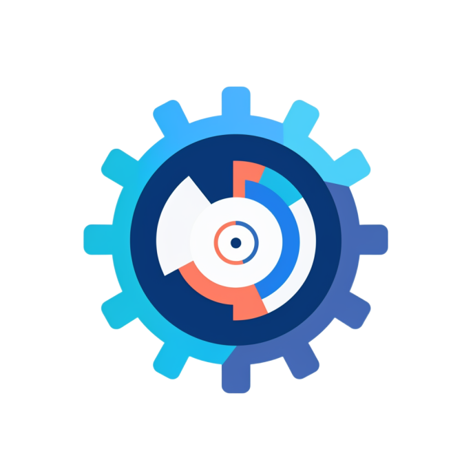

.. niai documentation master file, created by
   sphinx-quickstart on Tue Feb  1 09:48:41 2022.
   You can adapt this file completely to your liking, but it should at least
   contain the root `toctree` directive.

SimpML
======================================
This is the documentation of **SimpML**.

SimpML is an open source No/low code machine learning library in python that automates machine learning workflows.

By using SimpML you build your desired machine learning pipeline with few lines of code which shorten your time-to-model dramatically.

You can jump right into the package by looking into our :ref:`/examples/notebooks/QuickStart.ipynb`

The following chapters will explain the SimpML package in detail:

.. toctree::
   :maxdepth: 2
   :caption: Contents:
   
   examples/Introduction
   examples/QuickStart
   examples/TabularSupervisedUseCases
   examples/TabularUnsupervisedUseCases
   examples/VisionUseCases
   examples/TimeSeriesUseCases
   examples/TabularLowLevel

Indices and tables
==================

* :ref:`genindex`
* :ref:`modindex`
* :ref:`search`

About NI
======================================
At NI, we Engineer Ambitiously. We celebrate creative problem solving. And we take our customer relationships to heart. 

We believe in the power and potential of making connections—between people, ideas, and technology. In fact, connection is central to everything we do. We constantly challenge ourselves to find those connections because that’s what creates a path forward. This means bringing the right people together to build solutions that make a difference. It means combining fresh perspectives with new technologies to turn your vision into reality.

For more than four decades, we’ve set the standard in automated test and automated measurement systems. We’re proud to partner with the talented engineers and enterprises using our systems to solve the world’s most pressing technology challenges and build better businesses. From data and automation to research and validation, our tailored, software-connected approach is rooted in helping you engineer what’s next. As your trusted partner, we’re committed to helping you set your goals higher and reach them sooner.

We’re here for you, for each other, and for the next generation of innovators who think bigger, aim higher, and go faster. Let’s Engineer Ambitiously.